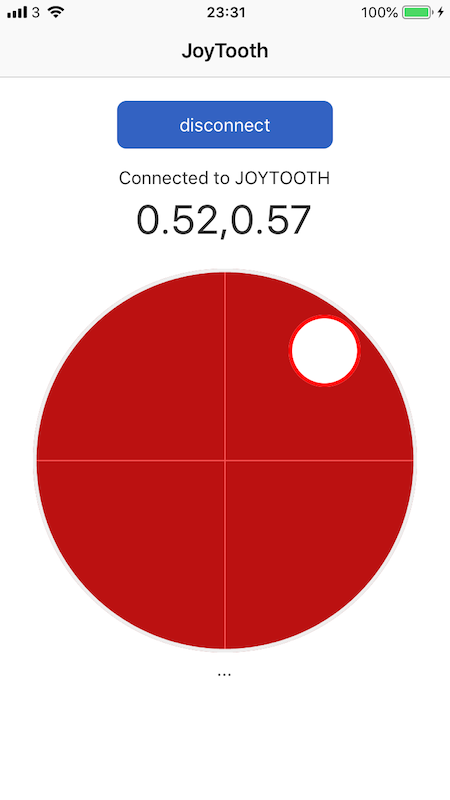
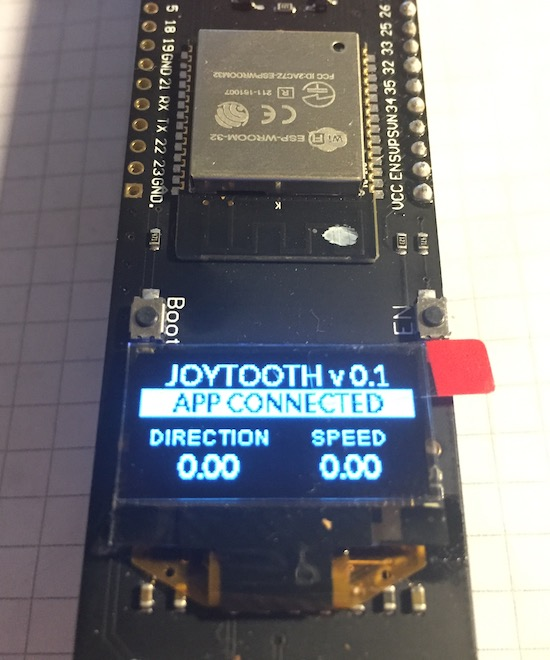

# titanium-BLE-ESP32-example

The folders contain the Javascript required to build an Axway Titanium iOS application (which *must* include the [**ti.bluetooth** iOS module](https://github.com/hansemannn/titanium-bluetooth)) and also an Arduino sketch for an ESP32 micro-controller module and 64x32 OLED screen. 

The Arduino sketch uses the latest ESP32 BLE Arduino library from https://github.com/nkolban/ESP32_BLE_Arduino. 

The mobile application emulates a kind of joystick/gamepad and sends `x,y` values between `-1.0` and `1.0` to the ESP32, which updates the `x` and `y` values on the screen. 

This is just an example/test to learn how to use something like this to control some motors for a robot project or something similar. 

--------

@kosso December 2018